# VideoMimic Real-to-Sim


https://github.com/user-attachments/assets/606049bf-464e-4a16-bc82-9beaaa4fbcc1

[Input]: [RGB Video](https://www.youtube.com/shorts/yvgGak8D4ls)  
[Output]: [Env (pc + mesh) + Human + Robot](https://www.youtube.com/shorts/ZsqrKNh-eas)

This is VideoMimic's vision pipeline that reconstructs 3D environments and human motion from single-camera videos, then retargets the motion to humanoid robots. The system processes monocular videos to extract human poses in world coordinates and maps them to robot configurations for imitation learning. The 3D environment is reconstructed as a pointcloud and meshified later.

## Quick Start

### 📚 Documentation

- **[Setup Guide](docs/setup.md)** - Installation and environment setup
- **[Directory Structure](docs/directory.md)** - Project organization about downloading files and input/output locations
- **[Commands Guide](docs/commands.md)** - Step-by-step processing commands
- **[Multi-Human Support](docs/multihuman.md)** - Processing multiple people in scenes
- **[Sequential Processing](docs/sequential_processing.md)** - Efficient dataset building by processing videos sequentially

### 🚀 Quick Pipeline

```bash
# Prepare `demo_data` directory
# Extract frames from video
python utilities/extract_frames_from_video.py --video-path video.MOV --output-dir ./demo_data/input_images/video_name/cam01

# Run complete pipeline
./process_video.sh <video_name> <start_frame> <end_frame> <subsample_factor> g1 <height>
# Example: ./process_video.sh my_video 0 100 2 g1 1.8
# height -1 uses auto-detected height from the video (default)
# height 0 uses the g1's shape

# Visualize results
conda activate vm1rs
python visualization/complete_results_egoview_visualization.py \
    --postprocessed-dir ./demo_data/output_calib_mesh/<result_dir> \
    --robot-name g1 --is-megasam
```

## Key Features

- **Single-Camera Input**: Works with standard RGB videos
- **3D Environment Reconstruction**: Dense 3D scene geometry from video
- **Human Motion in World Coordinates**: Accurate 3D human poses aligned with *scaled* environment
- **Multi-Human Support**: Track (detection + reid) and reconstruct multiple people simultaneously
- **Robot Motion Retargeting**: {Collision,Contact-aware} Human-to-Humanoid (G1) motion retargeting / multi-robot support 
- **Sequential Processing**: Efficient dataset building with amortized model loading and JAX compilation

## Pipeline Visualization

<table>
  <tr>
    <td align="center">
      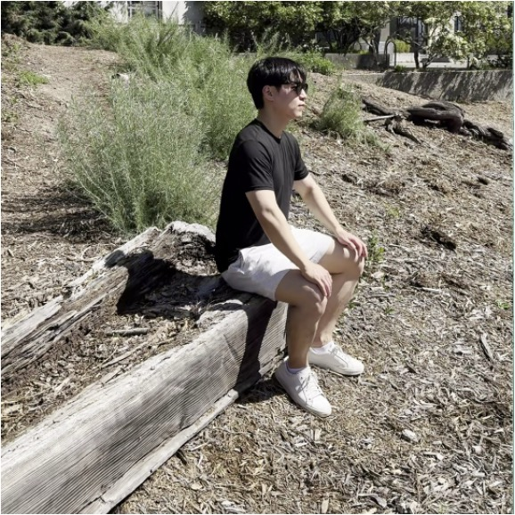<br>
      <b>RGB Input</b><br>
      <i>Raw Video</i>
    </td>
    <td align="center">
      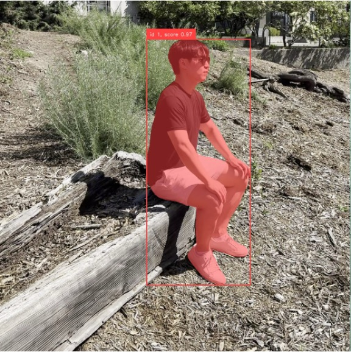<br>
      <b>SAM2</b><br>
      <i>Human Segmentation</i>
    </td>
    <td align="center">
      <br>
      <b>ViTPose</b><br>
      <i>2D Pose Estimation</i>
    </td>
  </tr>
  <tr>
    <td align="center">
      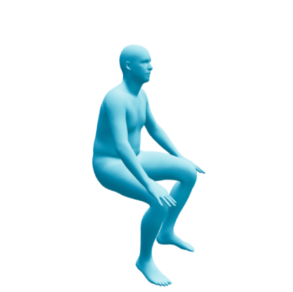<br>
      <b>VIMO</b><br>
      <i>3D Human Mesh</i>
    </td>
    <td align="center">
      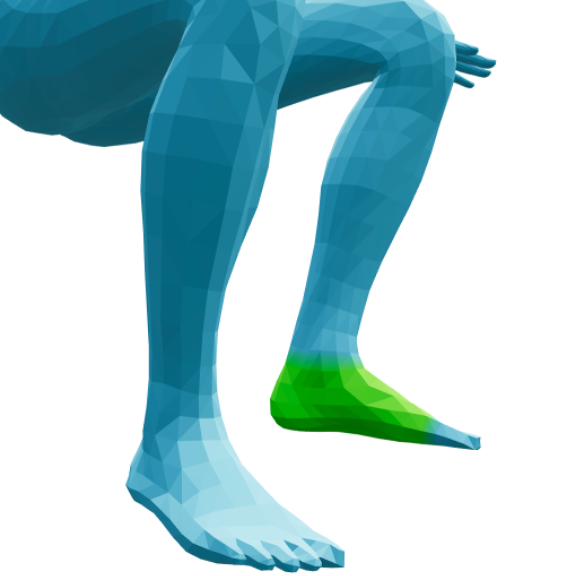<br>
      <b>BSTRO</b><br>
      <i>Contact Detection</i>
    </td>
    <td align="center">
      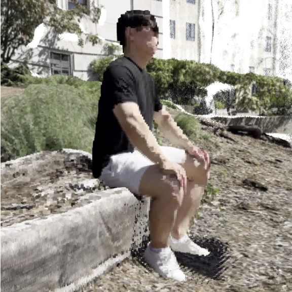<br>
      <b>MegaSAM</b><br>
      <i>Environment Reconstruction</i>
    </td>
  </tr>
  <tr>
    <td align="center">
      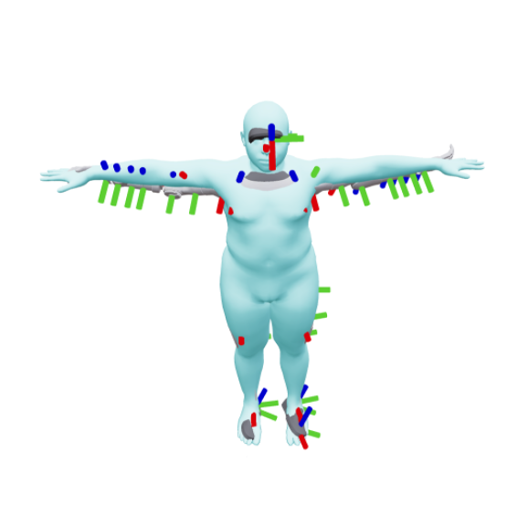<br>
      <b>Shape Fitting</b><br>
      <i>for G1</i>
    </td>
    <td align="center">
      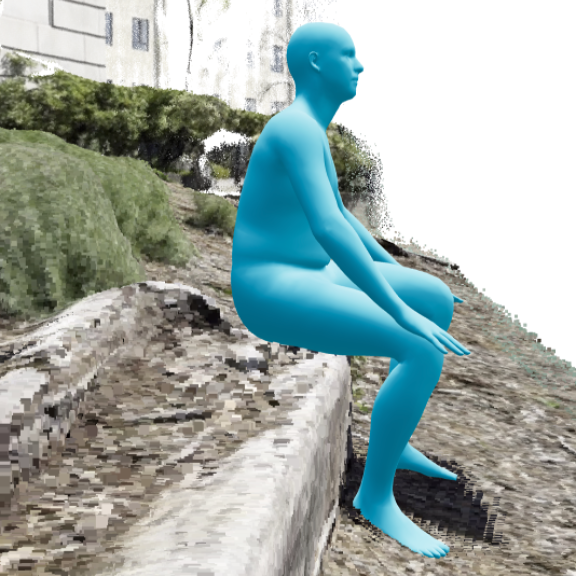<br>
      <b>MegaHunter</b><br>
      <i>Human-Scene Alignment</i>
    </td>
    <td align="center">
      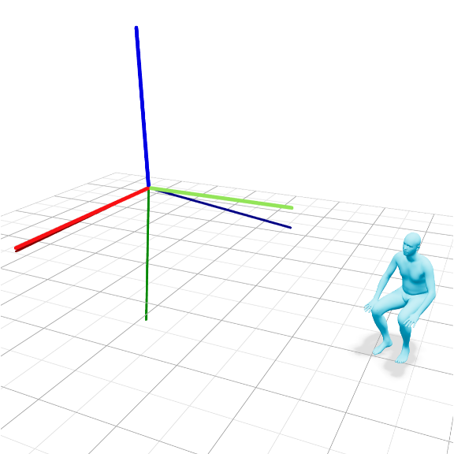<br>
      <b>GeoCalib</b><br>
      <i>Gravity Calibration</i>
    </td>
  </tr>
  <tr>
    <td align="center">
      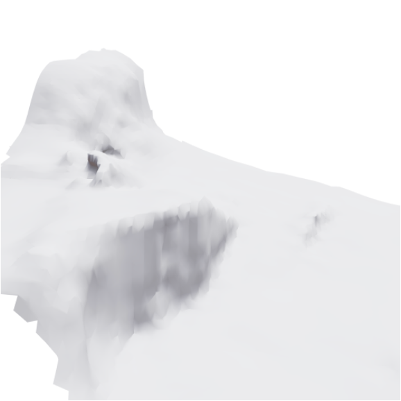<br>
      <b>NKSR</b><br>
      <i>Pointcloud to Mesh</i>
    </td>
    <td align="center">
      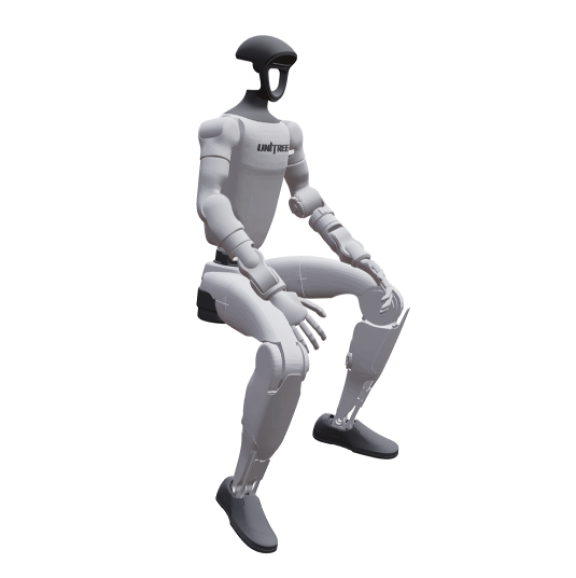<br>
      <b>PyRoKi</b><br>
      <i>Robot Motion Retargeting</i>
    </td>
    <td align="center">
      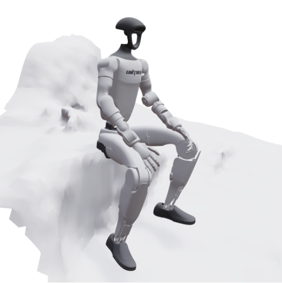<br>
      <b>Simulation-ready Dataset</b><br>
      <i>Env Mesh + Robot</i>
    </td>
  </tr>
</table>


## Citation

```bibtex
@article{videomimic,
          title     = {Visual imitation enables contextual humanoid control},
          author    = {Allshire, Arthur and Choi, Hongsuk and Zhang, Junyi and McAllister, David 
                       and Zhang, Anthony and Kim, Chung Min and Darrell, Trevor and Abbeel, 
                       Pieter and Malik, Jitendra and Kanazawa, Angjoo},
          journal   = {arXiv preprint arXiv:2505.03729},
          year      = {2025}
        }
```
